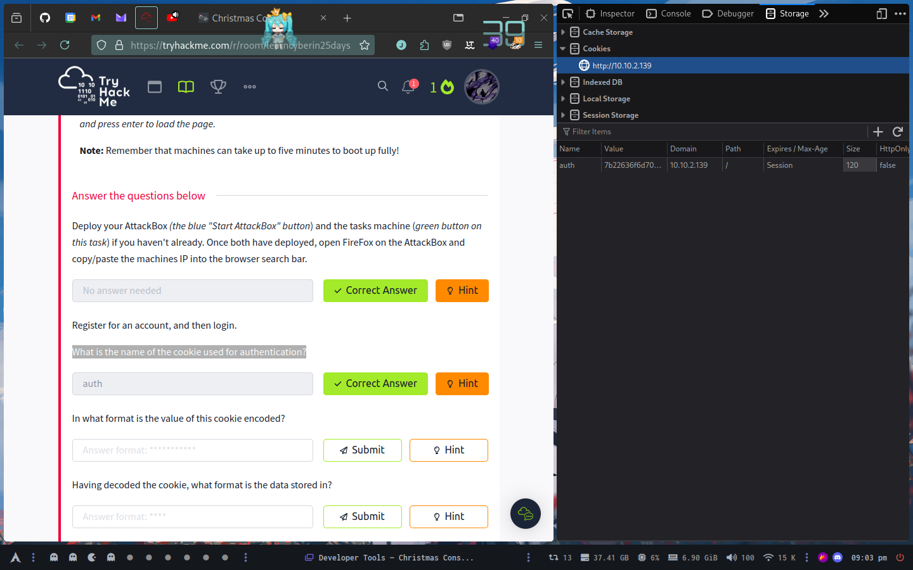
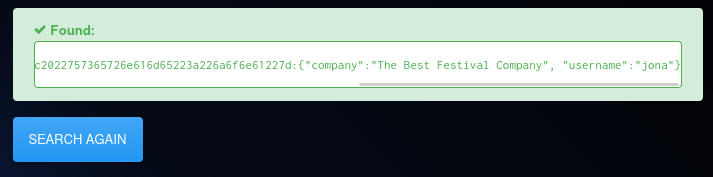
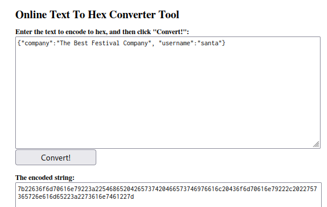

# Day 1

## A Christmas Crisis

### What is the name of the cookie used for authentication?

### In what format is the value of this cookie encoded?

Hexadecimal

### Having decoded the cookie, what format is the data stored in?

JSON

### What is the value of Santa's cookie?

### What is the flag you're given when the line is fully active?

We can decode the cookie, change the username and re-encoded to obtain the flag

THM{MjY0Yzg5NTJmY2Q1NzM1NjBmZWFhYmQy}
