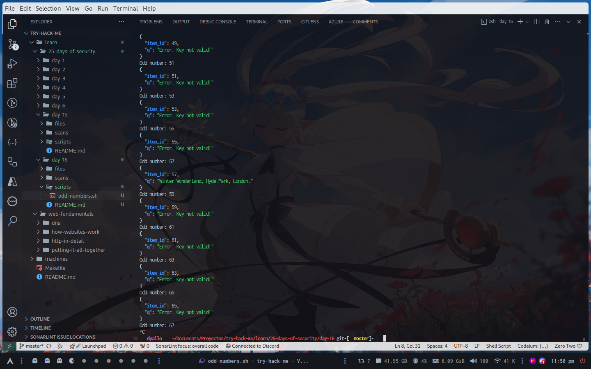

# Day 16

## Help! Where is Santa?

### What is the port number for the web server?

80

### Without using enumerations tools such as Dirbuster, what is the directory for the API?  (without the API key)

After seeing the source code could be this?

```html
                    <div class="column is-3">
                        <h2><strong>Category</strong></h2>
                        <ul>
                            <li><a href="#">Labore et dolore magna aliqua</a></li>
                            <li><a href="#">Kanban airis sum eschelor</a></li>
                            <li><a href="http://machine_ip/api/api_key">Modular modern free</a></li>
                            <li><a href="#">The king of clubs</a></li>
                            <li><a href="#">The Discovery Dissipation</a></li>
                            <li><a href="#">Course Correction</a></li>
                            <li><a href="#">Better Angels</a></li>
                        </ul>
                    </div>
```

### Where is Santa right now?



### Find out the correct API key. Remember, this is an odd number between 0-100. After too many attempts, Santa's Sled will block you. 

The number is 57