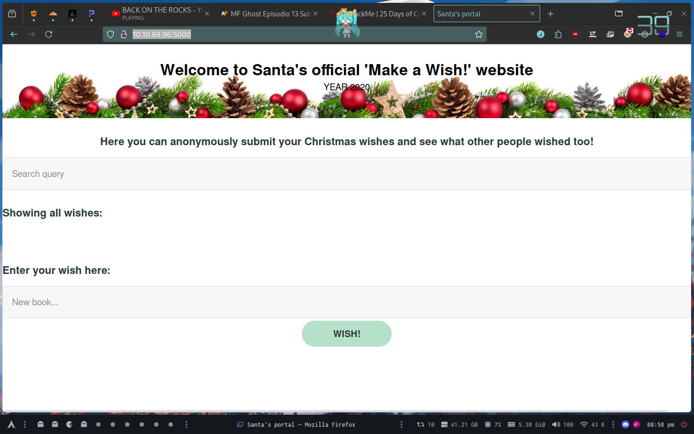
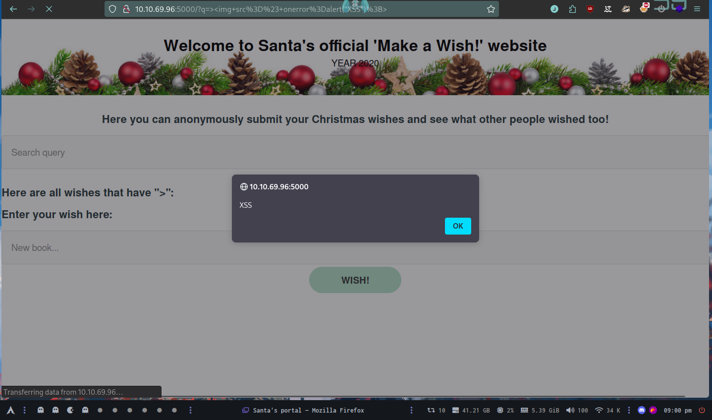
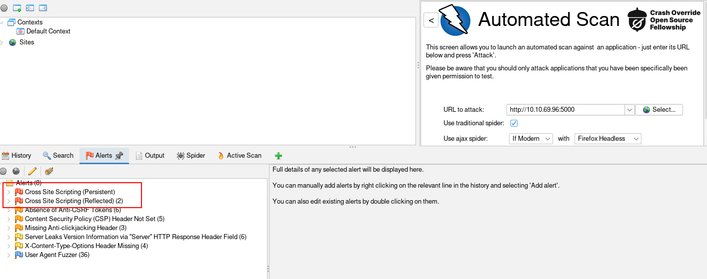

# Day 6

##  Be careful with what you wish on a Christmas night

Deploy your AttackBox (the blue "Start AttackBox" button) and the tasks machine (green button on this task) if you haven't already. Once both have deployed, open Firefox on the AttackBox and copy/paste the machines IP (http://10.10.69.96:5000) into the browser search bar (the webserver is running on port 5000, so make sure this is included in your web requests).



### What vulnerability type was used to exploit the application?

Stored cross-site scripting

```html
>
```



### What query string can be abused to craft a reflected XSS?

The answer is `?q=`

### Run a ZAP (zaproxy) automated scan on the target. How many XSS alerts are in the scan?

