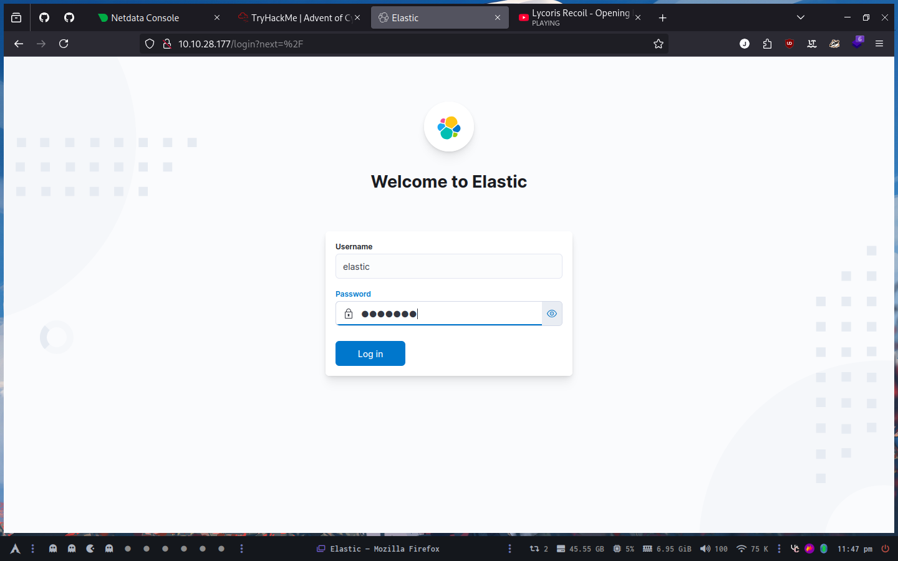
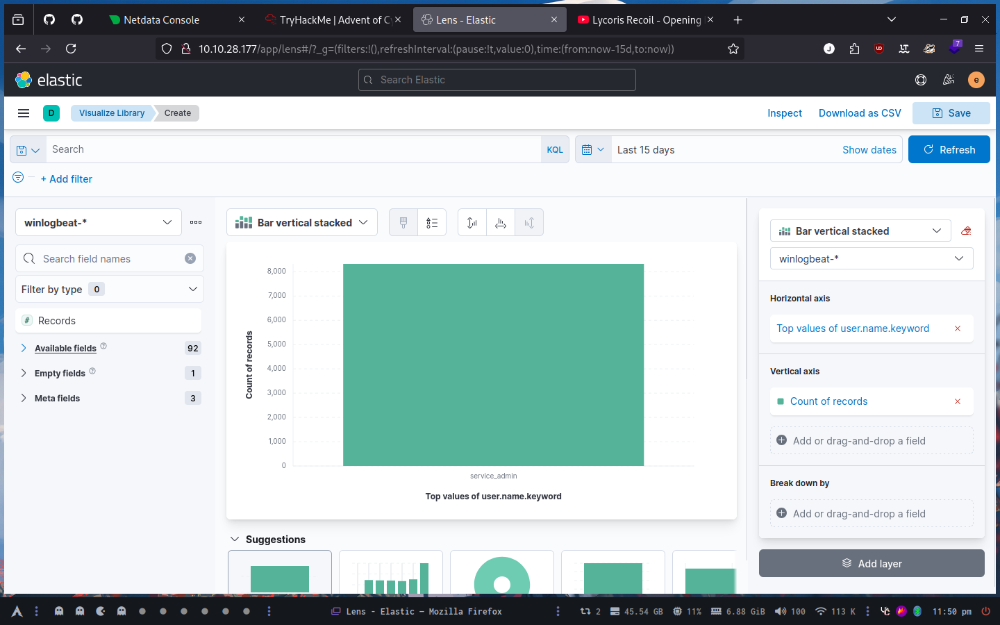
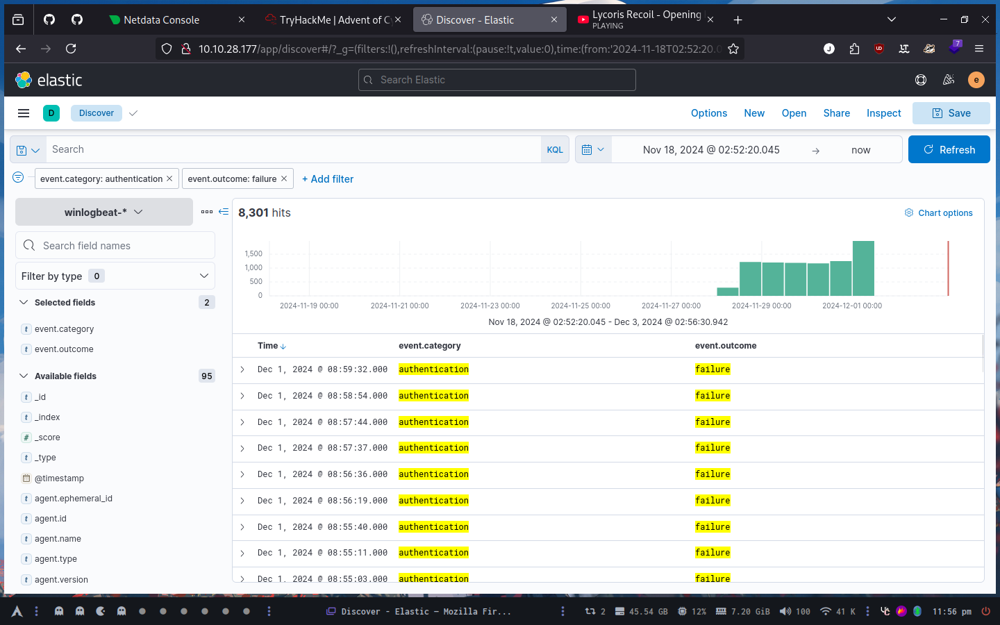
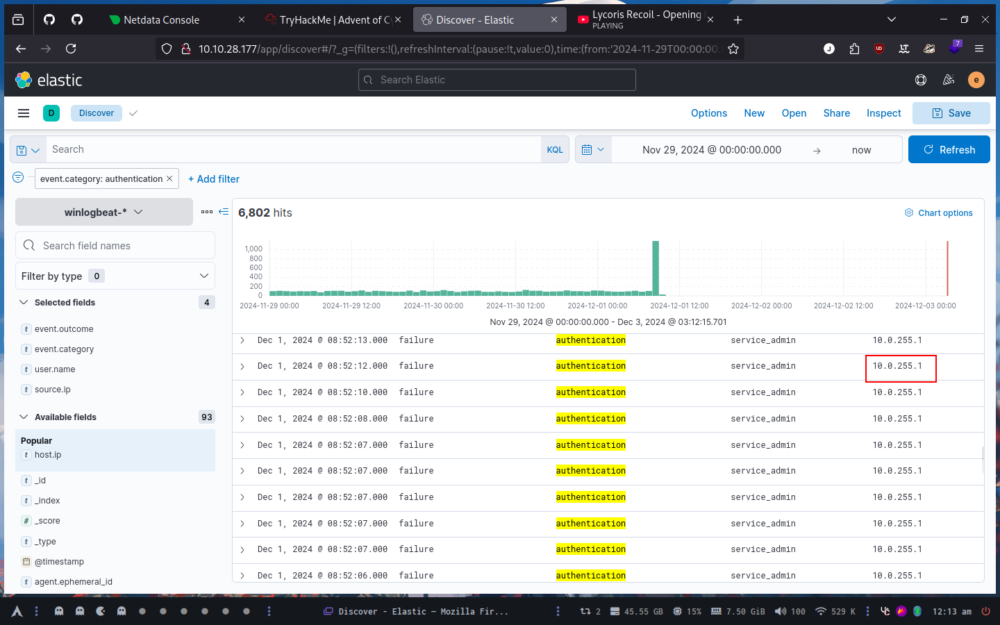
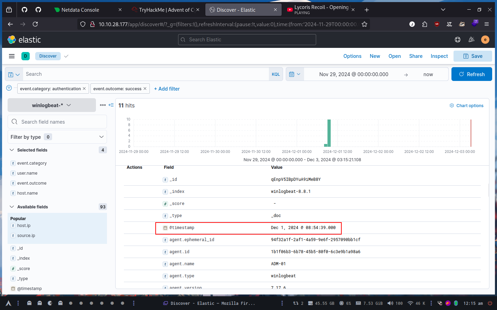
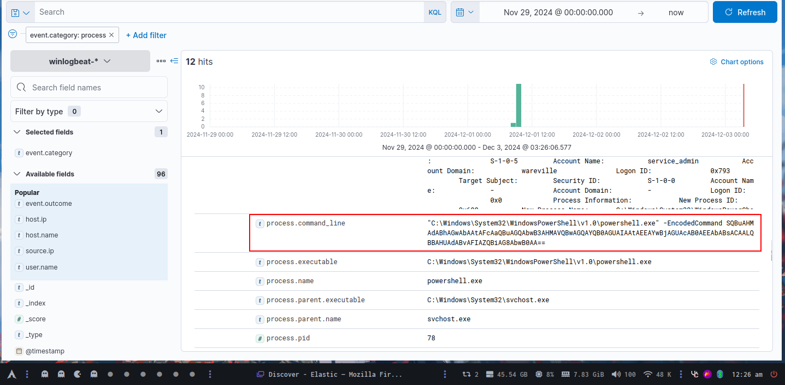

# Try Hack Me

##  Day 2: One man's false positive is another man's potpourri.



### What is the name of the account causing all the failed login attempts?

After viewing the logs, the username is `service_admin`



### How many failed logon attempts were observed?

We search for event.category = "authentication" and event.outcome = "failure"



### What is the IP address of Glitch?

With these parameters, we get the IP address of Glitch



10.0.255.1

### When did Glitch successfully logon to ADM-01? Format: MMM D, YYYY HH:MM:SS.SSS

We search for event.category = "authentication" and event.outcome = "success" and host.name = "ADM-01"



### What is the decoded command executed by Glitch to fix the systems of Wareville?

We search for event.category = "process"



```shell
echo "SQBuAHMAdABhAGwAbAAtAFcAaQBuAGQAbwB3AHMAVQBwAGQAYQB0AGUAIAAtAEEAYwBjAGUAcAB0AEEAbABsACAALQBBAHUAdABvAFIAZQBiAG8AbwB0AA==" | base64 -d
Install-WindowsUpdate -AcceptAll -AutoReboot
```