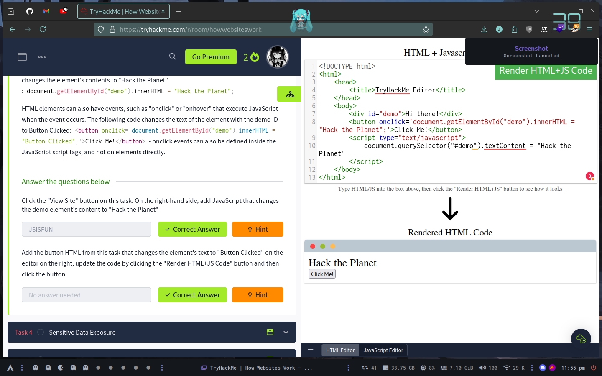

# How webisites work

## What term best describes the component of a web application rendered by your browser?

Front End

## One of the images on the cat website is broken - fix it, and the image will reveal the hidden text answer!

HTMLHERO

## Add a dog image to the page by adding another img tag () on line 11. The dog image location is img/dog-1.png. What is the text in the dog image?

DOGHTML

# Javascript

# Sensitive Information

# HTML Injection

