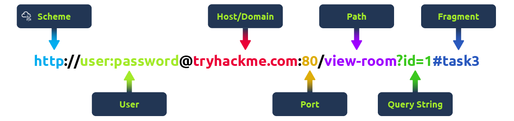
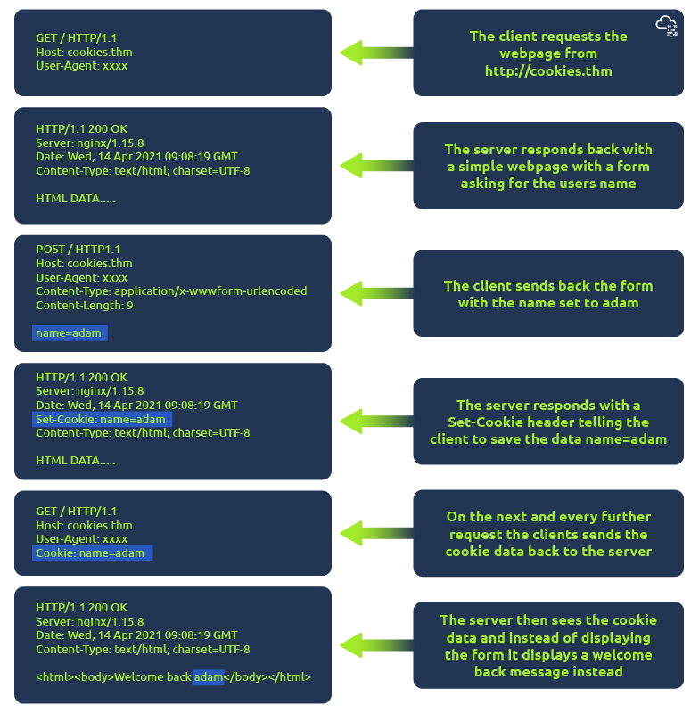

# What is HTTP(S)?

What is HTTP? (HyperText Transfer Protocol)

HTTP is what's used whenever you view a website, developed by Tim Berners-Lee and his team between 1989-1991. HTTP is the set of rules used for communicating with web servers for the transmitting of webpage data, whether that is HTML, Images, Videos, etc.

What is HTTPS? (HyperText Transfer Protocol Secure)
HTTPS is the secure version of HTTP. HTTPS data is encrypted so it not only stops people from seeing the data you are receiving and sending, but it also gives you assurances that you're talking to the correct web server and not something impersonating it.

## What does HTTP stand for?

HyperText Transfer Protocol

## What does the S in HTTPS stand for?

Secure

## On the mock webpage on the right there is an issue, once you've found it, click on it. What is the challenge flag?

THM{INVALID_HTTP_CERT}

# Request and Responses

What is a URL? (Uniform Resource Locator)



```shell
HTTP/1.1 200 OK
Server: nginx/1.15.8
Date: Fri, 09 Apr 2021 13:34:03 GMT
Content-Type: text/html
Content-Length: 98

<html>
<head>
    <title>TryHackMe</title>
</head>
<body>
    Welcome To TryHackMe.com
</body>
</html>
```

## What HTTP protocol is being used in the above example?

HTTP/1.1

## What response header tells the browser how much data to expect?

Content-Length

# HTTP Methods

HTTP methods are a way for the client to show their intended action when making an HTTP request. There are a lot of HTTP methods but we'll cover the most common ones, although mostly you'll deal with the GET and POST method.

## What method would be used to create a new user account?

POST

## What method would be used to update your email address?

PUT

## What method would be used to remove a picture you've uploaded to your account?

DELETE

## What method would be used to view a news article?

GET

# HTTP Status Codes

100-199 - Information Response	These are sent to tell the client the first part of their request has been accepted and they should continue sending the rest of their request. These codes are no longer very common.
200-299 - Success	This range of status codes is used to tell the client their request was successful.
300-399 - Redirection	These are used to redirect the client's request to another resource. This can be either to a different webpage or a different website altogether.
400-499 - Client Errors	Used to inform the client that there was an error with their request.
500-599 - Server Errors	This is reserved for errors happening on the server-side and usually indicate quite a major problem with the server handling the request.

## What response code might you receive if you've created a new user or blog post article?

201

## What response code might you receive if you've tried to access a page that doesn't exist?

404

## What response code might you receive if the web server cannot access its database and the application crashes?

503

## What response code might you receive if you try to edit your profile without logging in first?

401

# Headers

Headers are additional bits of data you can send to the web server when making requests.

Although no headers are strictly required when making a HTTP request, you’ll find it difficult to view a website properly.

## What header tells the web server what browser is being used?

User-Agent

## What header tells the browser what type of data is being returned?

Content-Type

## What header tells the web server which website is being requested?

Host

# Cookies



## Which header is used to save cookies to your computer?

Set-Cookie

# Making a Request

## Make a GET request to /room

```shell
HTTP/1.1 200 Ok
Server: nginx/1.15.8
Wed, 18 Sep 2024 1:32:14 GMT
Content-Type: text/html; charset=utf-8
Content-Length: 252
Last-Modified: Wed, 18 Sep 2024 1:32:14 GMT

<html>
<head>
    <title>TryHackMe</title>
</head>
<body>
    Welcome to the Room page THM{YOU'RE_IN_THE_ROOM}
</body>
</html>
```

## Make a GET request to /blog and using the gear icon set the id parameter to 1 in the URL field

```shell
HTTP/1.1 200 Ok
Server: nginx/1.15.8
Wed, 18 Sep 2024 1:33:25 GMT
Content-Type: text/html; charset=utf-8
Content-Length: 250
Last-Modified: Wed, 18 Sep 2024 1:33:25 GMT

<html>
<head>
    <title>TryHackMe</title>
</head>
<body>
    Viewing Blog article 1 THM{YOU_FOUND_THE_BLOG}
</body>
</html>
```

## Make a PUT request to /user/2 with the username parameter set to admin

```shell
HTTP/1.1 200 Ok
Server: nginx/1.15.8
Wed, 18 Sep 2024 1:34:13 GMT
Content-Type: text/html; charset=utf-8
Content-Length: 250
Last-Modified: Wed, 18 Sep 2024 1:34:13 GMT

<html>
<head>
    <title>TryHackMe</title>
</head>
<body>
    The user has been deleted THM{USER_IS_DELETED}
</body>
</html>
```

## Make a PUT request to /user/2 with the username parameter set to admin

```shell
HTTP/1.1 200 Ok
Server: nginx/1.15.8
Wed, 18 Sep 2024 1:35:1 GMT
Content-Type: text/html; charset=utf-8
Content-Length: 251
Last-Modified: Wed, 18 Sep 2024 1:35:1 GMT

<html>
<head>
    <title>TryHackMe</title>
</head>
<body>
    Username changed to admin THM{USER_HAS_UPDATED}
</body>
</html>
```

## POST the username of thm and a password of letmein to /login

```shell
HTTP/1.1 200 Ok
Server: nginx/1.15.8
Wed, 18 Sep 2024 1:36:40 GMT
Content-Type: text/html; charset=utf-8
Content-Length: 256
Last-Modified: Wed, 18 Sep 2024 1:36:40 GMT

<html>
<head>
    <title>TryHackMe</title>
</head>
<body>
    You logged in! Welcome Back THM{HTTP_REQUEST_MASTER}
</body>
</html>
```