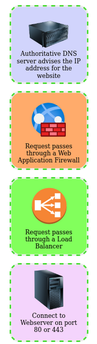

# Putting It All Together

From the previous modules, you'll have learned that quite a lot of things go on behind the scenes when you request a webpage in your browser.

To summarise, when you request a website, your computer needs to know the server's IP address it needs to talk to; for this, it uses DNS. Your computer then talks to the web server using a special set of commands called the HTTP protocol; the webserver then returns HTML, JavaScript, CSS, Images, etc., which your browser then uses to correctly format and display the website to you.

## Other Components

Load Balancers
CDN (Content Delivery Networks)
Databases
WAF (Web Application Firewall)

### What can be used to host static files and speed up a clients visit to a website?

CDN

### What does a load balancer perform to make sure a host is still alive?

Health check

### What can be used to help against the hacking of a website?

WAF

## How Web Servers Work?

### What does web server software use to host multiple sites?

Virtual Hosts

### What is the name for the type of content that can change?

Dynamic

### Does the client see the backend code? Yay/Nay

Nay

## Quiz

THM{YOU_GOT_THE_ORDER}

