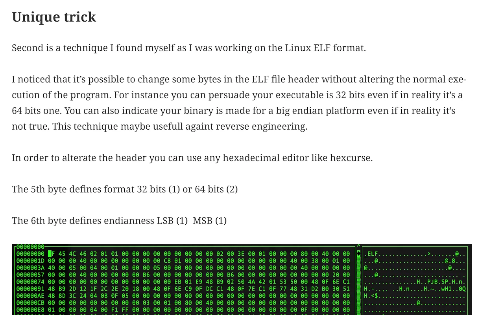
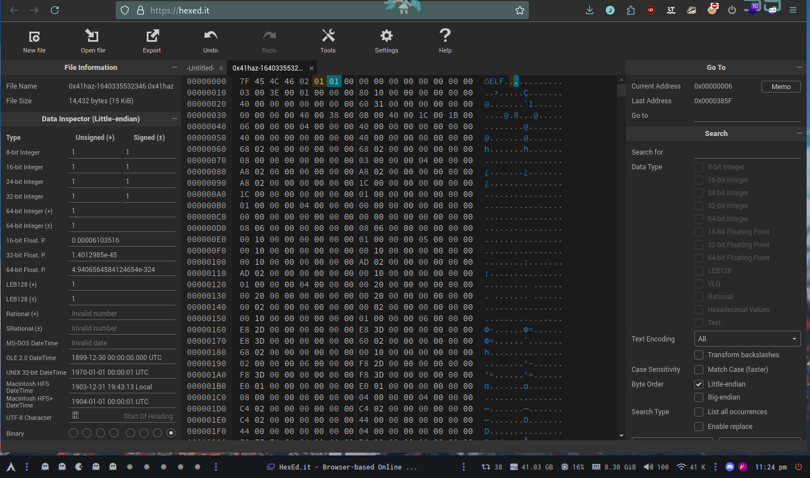

# tryhackme

## 0x41haz

We download the binary and try to use it

```shell
./0x41haz-1640335532346.0x41haz
=======================
Hey , Can You Crackme ?
=======================
It's jus a simple binary 
Tell Me the Password :
Pepe
Is it correct , I don't think so.
```

After that we check about the binary with `file`

```shell
file files/0x41haz-1640335532346.0x41haz
files/0x41haz-1640335532346.0x41haz: ELF 64-bit MSB *unknown arch 0x3e00* (SYSV)
```

Searching for the error `*unknown arch 0x3e00*` I've found the following



Since I don't have anything to edit a hex, I'll do it online



Now if we do a `file` we see the binary well

```shell
file files/0x41haz-1640335532346.0x41haz
files/0x41haz-1640335532346.0x41haz: ELF 64-bit LSB pie executable, x86-64, version 1 (SYSV), dynamically linked, interpreter /lib64/ld-linux-x86-64.so.2, BuildID[sha1]=6c9f2e85b64d4f12b91136ffb8e4c038f1dc6dcd, for GNU/Linux 3.2.0, stripped
```

```shell
rizin files/0x41haz-1640335532346.0x41haz
[0x00001165]> aaa
[x] Analyze all flags starting with sym. and entry0 (aa)
[x] Analyze function calls
[x] Analyze len bytes of instructions for references
[x] Check for classes
[x] Analyze local variables and arguments
[x] Type matching analysis for all functions
[x] Applied 0 FLIRT signatures via sigdb
[x] Propagate noreturn information
[x] Integrate dwarf function information.
[x] Resolve pointers to data sections
[x] Use -AA or aaaa to perform additional experimental analysis.
[0x00001080]> afl | grep main
0x00001165    8 219          main
[0x00001165]> pd 28 @ main
            ; DATA XREF from entry0 @ 0x109d
┌ int main(int argc, char **argv, char **envp);
│           ; var char *s @ stack - 0x48
│           ; var int64_t var_1eh @ stack - 0x1e
│           ; var int64_t var_16h @ stack - 0x16
│           ; var int64_t var_12h @ stack - 0x12
│           ; var int64_t var_10h @ stack - 0x10
│           ; var int64_t var_ch @ stack - 0xc
│           0x00001165      push  rbp
│           0x00001166      mov   rbp, rsp
│           0x00001169      sub   rsp, 0x40
│           0x0000116d      movabs rax, 0x6667243532404032             ; '2@@25$gf'
│           0x00001177      mov   qword [var_1eh], rax
│           0x0000117b      mov   dword [var_16h], 0x40265473          ; 'sT&@'
│           0x00001182      mov   word [var_12h], 0x4c                 ; 'L'
│           0x00001188      lea   rdi, [str.Hey___Can_You_Crackme]     ; 0x2008 ; "=======================\nHey , Can You Crackme ?\n=======================" ; const char *s
│           0x0000118f      call  sym.imp.puts                         ; sym.imp.puts ; int puts(const char *s)
│           0x00001194      lea   rdi, [str.It_s_jus_a_simple_binary]  ; 0x2050 ; "It's jus a simple binary \n" ; const char *s
│           0x0000119b      call  sym.imp.puts                         ; sym.imp.puts ; int puts(const char *s)
│           0x000011a0      lea   rdi, [str.Tell_Me_the_Password_:]    ; 0x206b ; "Tell Me the Password :" ; const char *s
│           0x000011a7      call  sym.imp.puts                         ; sym.imp.puts ; int puts(const char *s)
│           0x000011ac      lea   rax, [s]
│           0x000011b0      mov   rdi, rax                             ; char *s
│           0x000011b3      mov   eax, 0
│           0x000011b8      call  sym.imp.gets                         ; sym.imp.gets ; char *gets(char *s)
│           0x000011bd      lea   rax, [s]
│           0x000011c1      mov   rdi, rax                             ; const char *s
│           0x000011c4      call  sym.imp.strlen                       ; sym.imp.strlen ; size_t strlen(const char *s)
│           0x000011c9      mov   dword [var_10h], eax
│           0x000011cc      cmp   dword [var_10h], 0xd
│       ┌─< 0x000011d0      je    0x11e8
│       │   0x000011d2      lea   rdi, [str.Is_it_correct___I_don_t_think_so.] ; 0x2088 ; "Is it correct , I don't think so." ; const char *s
│       │   0x000011d9      call  sym.imp.puts                         ; sym.imp.puts ; int puts(const char *s)
│       │   0x000011de      mov   edi, 0                               ; int status
│       │   0x000011e3      call  sym.imp.exit                         ; sym.imp.exit ; void exit(int status)
│       └─> 0x000011e8      mov   dword [var_ch], 0
```

We can see that `0x0000116d` `0x0000117b` `0x00001182` are the pointers password respectively.

Then we add `THM{}` to the password and it will be the flag `THM{2@@25$gfsT&@L}`.

## Links

- https://pentester.blog/?p=247&source=post_page-----7a18647af002--------------------------------
- https://exploit-notes.hdks.org/exploit/reverse-engineering/cheatsheet/rizin-cheatsheet/