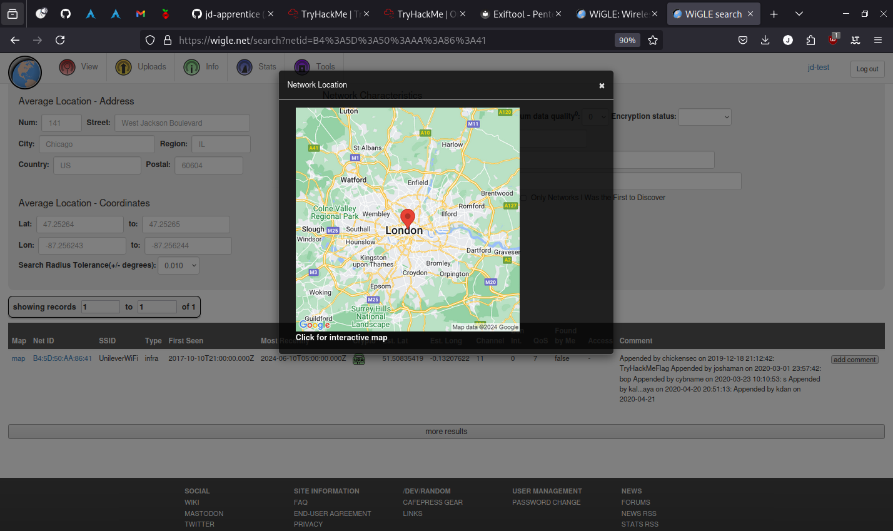
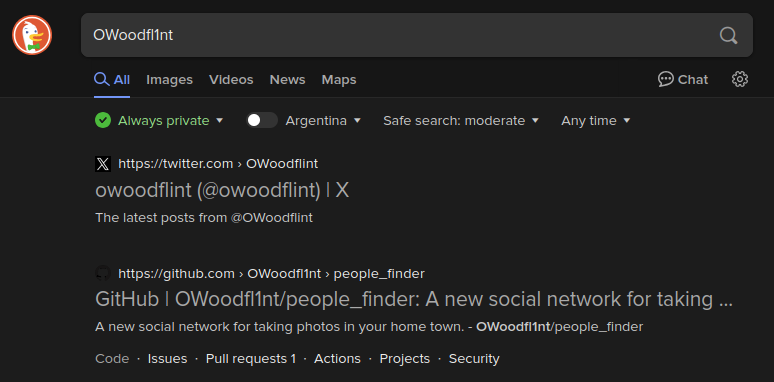
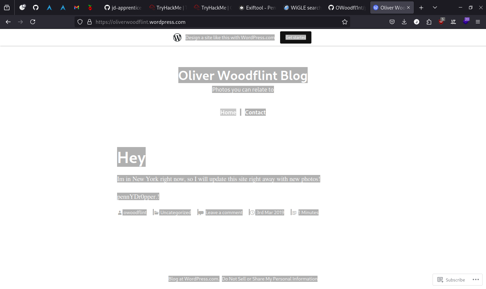

## 1. What is this user's avatar of?

```shell
exiftool machines/OhSINT/WindowsXP_1551719014755.jpg
ExifTool Version Number         : 12.57
File Name                       : WindowsXP_1551719014755.jpg
Directory                       : machines/OhSINT
File Size                       : 234 kB
File Modification Date/Time     : 2024:08:25 01:41:54-03:00
File Access Date/Time           : 2024:08:25 01:56:07-03:00
File Inode Change Date/Time     : 2024:08:25 01:46:26-03:00
File Permissions                : -rw-r--r--
File Type                       : JPEG
File Type Extension             : jpg
MIME Type                       : image/jpeg
XMP Toolkit                     : Image::ExifTool 11.27
GPS Latitude                    : 54 deg 17' 41.27" N
GPS Longitude                   : 2 deg 15' 1.33" W
Copyright                       : OWoodflint
Image Width                     : 1920
Image Height                    : 1080
Encoding Process                : Baseline DCT, Huffman coding
Bits Per Sample                 : 8
Color Components                : 3
Y Cb Cr Sub Sampling            : YCbCr4:2:0 (2 2)
Image Size                      : 1920x1080
Megapixels                      : 2.1
GPS Latitude Ref                : North
GPS Longitude Ref               : West
GPS Position                    : 54 deg 17' 41.27" N, 2 deg 15' 1.33" W
```

With the `Copyright` tag, if we paste it into the search bar of the web browser, we found a twitter account of this user: [@OWoodflint](https://twitter.com/OWoodflint), and his avatar is a cat.

## 2. In the twitter account we can see the following information:

```
Bssid: B4:5D:50:AA:86:41 - Go nuts!
```

With this information, we can search about the device in wigle, in the advanced search use the BSSID of the device, found that the device is located in London.



## 3. What is the SSID of the device?

Found in the screenshot from the step 2 `UnileverWiFi`

## 4. What is the email of the user?

After his twitter there is also a github profile with the same name: [@OWoodflint](https://github.com/OWoodflint)



Inside there is a project called `people_finder` and the readme shows the following:

```markdown
people_finder

Hi all, I am from London, I like taking photos and open source projects.

Follow me on twitter: @OWoodflint

This project is a new social network for taking photos in your home town.

Project starting soon! Email me if you want to help out: OWoodflint@gmail.com

https://oliverwoodflint.wordpress.com/
```

## 5. What site did you find his email address on?

So the page where the repository is located is called `Github`

## 6. Where has he gone on holiday?

Inside `https://oliverwoodflint.wordpress.com/` is a post about what he has gone on holiday, which is `New York`

## 7. What is his password?

The password is in front of our eyes

